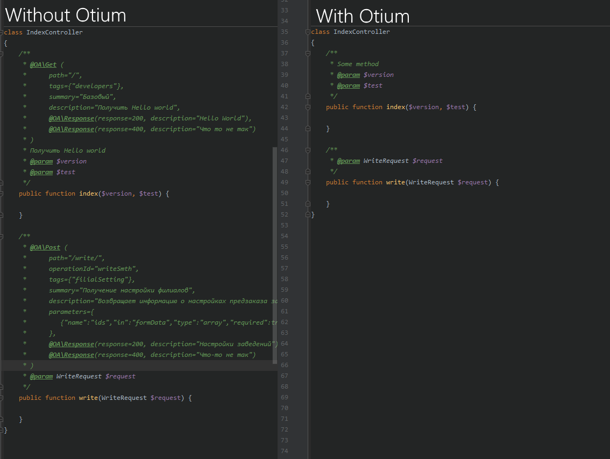

# Otium - Documentation Generator
Генерация документации API без использования Swagger, OpenApi комментариев в коде

~~Работает поверх пакета l5-swagger (пока что)~~



## Install 
```shell script
composer require lootjs/otium
```
Then run:
```
php artisan vendor:publish --provider="Loot\Otium\ServiceProvider"
```
### Config
Настройку можно сделать в файле config/otium.php

### Usage
После команды `php artisan l5-swagger:generate`, запустить:
```shell script
php artisan loot:generate-docs
```

### Todo
- Добавить поддержку apiblueprint.org
- Добавить поддержку кеширования методов, вместо постоянного использования Reflection
- Добавить поддержку пакета swagger ui, вместо l5-swagger
- Добавить поддержку swagger 2.0
